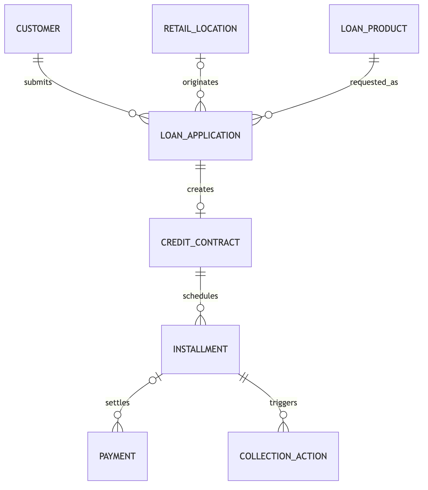

# Unicorn Finance workshop dataset guide

**Updated at:** 2026-09-16

*Participant guide to Unicorn Finance’s synthetic core-lending dataset. It explains the fictional business scenario, the purpose and grain of all eight tables, their relationships, and common analysis paths.*

<style>
@page { size: A4 portrait; margin: 1.35cm; }
img { display: block; max-width: 100%; max-height: 19cm; width: auto; height: auto; margin: 0.5cm auto; object-fit: contain; }
table { font-size: 8.5pt; }
</style>

## Where to find the data

All workshop tables are managed Delta tables in the default namespace:

```text
hc_workshop.core_lending
```

Example:

```sql
SELECT *
FROM hc_workshop.core_lending.loan_application
LIMIT 10;
```

## Important disclaimer

Unicorn Finance is fictional and this dataset is entirely synthetic. It was created for the Home Credit Philippines enablement workshop, but it is **not Home Credit production data** and does not reproduce Home Credit’s products or physical core-system schema.

Names, national IDs, phone numbers, applications, stores, contracts, payments, and collection events are fabricated. Treat synthetic PII as sensitive during the governance exercises.

## Business scenario

Unicorn Finance’s POS installment product is its acquisition engine. Nova Mobile subsidises a campaign in which approved customers finance selected smartphones over 6, 9, or 12 months at 0% monthly interest. Customers still repay principal and may pay a processing fee; “0%” does not mean a free phone, zero down payment, zero fees, or guaranteed approval. The campaign increases application and contract volume. A minority of originations then show first-payment default concentrated in a small number of retail locations and sales associates. The top 20% of stores also account for roughly 80% of in-store applications.

The dataset is **not limited to that promotion**. It covers the broader core-lending lifecycle and includes POS installment, cash loan, Unicorn Flex revolving credit, and Unicorn Visa records across a two-year window. The promotion is one deliberately detectable cohort for investigation.

Participants can use the data to:

- Understand product and origination performance.
- Analyze approval and conversion rates.
- Calculate delinquency and first-payment default.
- Identify store and associate concentrations.
- Measure collection outcomes.
- Apply governance controls to customer and underwriting data.

## Schema at a glance

The schema follows the lending lifecycle from customer and product reference data through origination, servicing, and collections. **Grain** states exactly what one row represents.

| Domain | Table | Grain | Purpose |
|---|---|---|---|
| Reference | **`customer`** | One borrower or prospect | Customer identity, contact, employment, income, and geography for origination and governance exercises |
| Reference | **`retail_location`** | One physical partner store | Merchant, store, and geographic context for volume and concentration analysis |
| Reference | **`loan_product`** | One product version | Commercial limits, tenor ranges, rates, and interest methods used to interpret applications and contracts |
| Origination | **`loan_application`** | One credit request | Requested product and amount, channel, store, associate, promotion, underwriting decision, and financed item |
| Origination | **`credit_contract`** | One approved application converted to a contract | Accepted financial terms, product structure, origination date, maturity, and lifecycle status |
| Servicing | **`installment`** | One scheduled fixed-term obligation | Due amounts, due date, settlement state, and as-of outstanding amount |
| Servicing | **`payment`** | One payment attempt | Posted receipts and failed attempts applied to an installment and contract |
| Collections | **`collection_action`** | One action against one delinquent installment | Collection method, DPD at action, outcome, promise to pay, and directly attributed payment |

`loan_application` is the origination hub. Declined and cancelled applications do not produce contracts. Only fixed-term POS and cash contracts produce installments. Revolving products appear in applications and contracts but do not have generated transaction or statement tables in this workshop dataset.

## Entity relationships



Relationship interpretation:

- One customer can submit many applications.
- An application references one product and optionally one retail location.
- An approved application creates at most one contract.
- A fixed-term contract has many installments.
- An installment can have multiple payment attempts with posted or failed status.
- A delinquent installment can trigger multiple collection actions.

To keep the diagram readable, it shows the primary analytical path. `payment.contract_id` also links every payment directly to its contract, and `collection_action.contract_id` links each collection action to the parent contract.

## Primary join paths

### Customer to application

```sql
FROM hc_workshop.core_lending.customer c
JOIN hc_workshop.core_lending.loan_application a
  ON c.customer_id = a.customer_id
```

### Application to location and product

```sql
FROM hc_workshop.core_lending.loan_application a
LEFT JOIN hc_workshop.core_lending.retail_location l
  ON a.store_id = l.store_id
JOIN hc_workshop.core_lending.loan_product p
  ON a.product_id = p.product_id
```

`store_id` is nullable because digital and direct applications do not originate at a physical store.

### Application to contract

```sql
FROM hc_workshop.core_lending.loan_application a
LEFT JOIN hc_workshop.core_lending.credit_contract c
  ON a.application_id = c.application_id
```

Use a left join when measuring application conversion because declined and cancelled applications have no contract.

### Contract to installments and payments

```sql
FROM hc_workshop.core_lending.credit_contract c
JOIN hc_workshop.core_lending.installment i
  ON c.contract_id = i.contract_id
LEFT JOIN hc_workshop.core_lending.payment p
  ON i.installment_id = p.installment_id
```

One installment may have multiple payment attempts. Aggregate payments before joining when you need one row per installment.

### Contract to collections

```sql
FROM hc_workshop.core_lending.credit_contract c
JOIN hc_workshop.core_lending.collection_action ca
  ON c.contract_id = ca.contract_id
```

## Product concepts

- **POS installment** — Fixed-term purchase financing, usually originated in a partner store. Interest uses the add-on method unless a promotion reduces the customer rate to 0%.
- **Cash loan** — Unsecured cash financing, generally offered to existing customers with repayment history.
- **Unicorn Flex** — Revolving virtual credit line with a declining-balance interest method.
- **Unicorn Visa** — Revolving card product offered selectively to established customers.

Rates ending in `_rate_pct` are stored as percentage points. A value of `5.9900` means **5.99%**, not `0.0599`.

All monetary amounts are Philippine pesos unless the accompanying `currency_code` states otherwise.

## Source fields versus derived metrics

The core tables contain business events and contractual facts. The following should be calculated during analysis rather than expected in the source:

- Current days past due and DPD bucket.
- First-payment-default flag.
- Origination vintage.
- Current contract balance.
- On-time payment ratio.
- Estimated interest and fee income.
- Credit loss and suspected-fraud indicators.

`days_past_due_at_action` is intentionally stored on `collection_action`: it is an immutable snapshot explaining why the action was taken.

`installment.outstanding_amount` and `installment_status_code` are servicing state as of the configured dataset date. `payment` and `collection_action` are event histories. Moving the as-of date forward can therefore change existing installment state while adding later events.

For this workshop, **first-payment default (FPD)** means the first installment reached five days past due before full settlement. A settlement exactly five days after the due date counts as FPD. Only contracts whose first installment has reached that observation point by the declared as-of date belong in the denominator:

```sql
WHERE installment_no = 1
  AND date_add(due_date, 5) <= DATE'2026-09-01'
```

## Suggested questions

1. Which products and provinces generate the most applications?
2. What is the approval rate by product and channel?
3. Did Nova Mobile's 0%-interest smartphone financing campaign increase originations?
4. Which stores and associates have unusually high first-payment default?
5. How does cash-loan delinquency compare with POS installment delinquency?
6. What proportion of installments are paid on time, partially, or late?
7. Which collection actions produce the highest promise-to-pay and payment-received amounts?
8. Which columns should be masked or access-controlled?

## Data quality expectations

- Every application must reference an existing customer and product.
- Physical in-store applications should have a valid `store_id`.
- Only approved applications should create contracts.
- Contract terms must be within the selected product’s limits.
- Every installment must reference an existing contract.
- Posted payments must have a posting timestamp.
- Failed payments should have a failure reason.
- A `PAYMENT_RECEIVED` collection outcome must reconcile to a posted payment for the same installment, timestamp, and amount.
- Collection actions should occur only for delinquent obligations and never after an attributed payment.

For column-level definitions, open `data-dictionary.pdf` in the participant materials folder.
