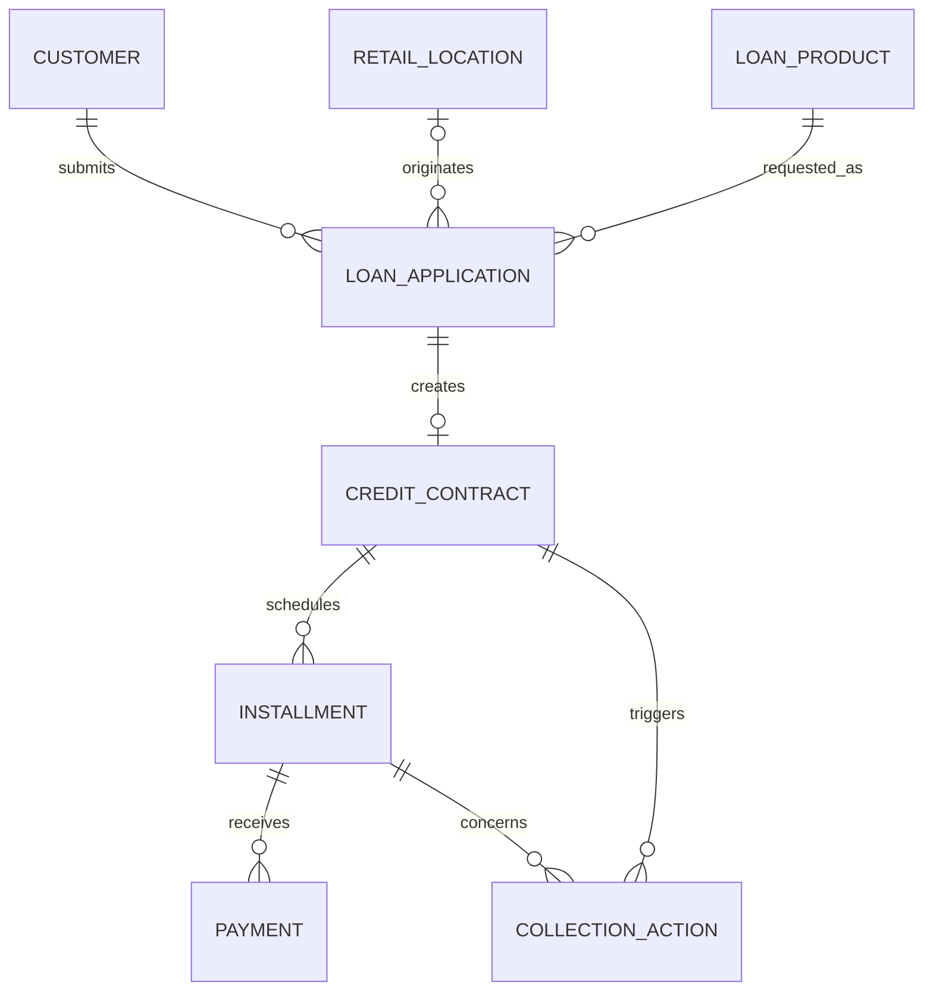

# Unicorn Finance core-lending source schema

**Updated at:** 2026-09-16

*Facilitator reference for the selected eight-table synthetic source model. Unicorn Finance is fictional; this model supports the Home Credit workshop but does not claim to reproduce a Home Credit production schema.*

## Selected scope

Use one attendee dataset in the default namespace `hc_workshop.core_lending`. The catalog name is configurable during workspace setup:

1. `customer`
2. `retail_location`
3. `loan_product`
4. `loan_application`
5. `credit_contract`
6. `installment`
7. `payment`
8. `collection_action`

The scope is final for dataset generation. Promotion, financed-item, and sales-associate attributes are embedded in `loan_application`; merchant attributes are embedded in `retail_location`. There is no attendee `promotion`, `sales_associate`, `financed_item`, `preapproved_offer`, or transaction table.

## Why this model

The model preserves the complete workshop path—customer → application → contract → repayment → collections—while retaining product and store dimensions for useful joins. It is small enough to teach in one day and still supports:

- Product, channel, store, and province performance.
- Approval and application-to-contract conversion.
- Installment schedules, payment behavior, DPD, and vintages.
- First-payment-default concentration by store and associate.
- Collection action and attributed-payment analysis.
- Governance exercises on synthetic PII and underwriting fields.

Cross-sell and next-best-product analysis are outside this generated dataset because it has no offer, response, or post-origination transaction event.

## Entity relationships



`store_id` is nullable for non-store channels. Only approved applications create contracts. Only fixed-term POS and cash contracts create installments in this release.

## Table roles

### Reference

- `customer` — Synthetic borrower/prospect identity, contact, employment, income, and current geography.
- `retail_location` — Physical store plus denormalized parent merchant and geography.
- `loan_product` — Eight commercial rule sets across POS installment, cash loan, Unicorn Flex, and Unicorn Visa.

### Origination

- `loan_application` — Request, point-in-time underwriting outcome, channel, product, store, local associate ID, promotion, and financed-item facts.
- `credit_contract` — Terms accepted from approved applications. Fixed-term products use `principal_amount`; revolving products use `credit_limit_amount`.

### Servicing

- `installment` — Fixed-term principal, interest, fee, due-date, settlement, and as-of outstanding facts.
- `payment` — Posted receipts and failed attempts for due installments.
- `collection_action` — Actions at 5, 30, 60, and 90 DPD, including promises and payments directly attributed to an action.

The physical column definitions, nullability, generated code values, and keys are authoritative in `data-dictionary.md`.

## Intended analytical story

A brand-subsidised 0% smartphone promotion increases POS originations. The top 20% of stores receive roughly 80% of in-store applications, and a small hotspot group receives additional promotion volume. Within that group, repeated store/associate pairs show elevated first-payment default.

This is an investigation signal, not a stored fraud label. Participants should test explanations rather than present the synthetic pattern as proven fraud.

For this workshop, first-payment default means the first installment reached five days past due before full settlement. A settlement exactly five days after the due date counts as FPD. Contracts are eligible only when:

```sql
date_add(first_installment.due_date, 5) <= DATE'2026-09-01'
```

Current DPD and FPD are derived metrics. `days_past_due_at_action` is stored because it is a historical snapshot of the collection trigger.

## Servicing consistency

- `POSTED` payments have `posted_at = payment_at` and no failure reason.
- `FAILED` attempts have a failure reason and no posting timestamp.
- A `PAYMENT_RECEIVED` collection outcome matches one posted payment on installment, timestamp, and amount.
- No collection milestone is generated after its attributed payment.
- Fixed-term installment principal reconciles to contract principal, with rounding residue assigned to the final installment.

## Governance fields

Recommended masking or restricted-access fields:

- `customer.national_id_no`
- `customer.mobile_number`
- `customer.email_address`
- `customer.monthly_income_amount`
- `loan_application.declared_income_amount`
- `loan_application.underwriting_score`
- `loan_application.decision_reason_code`
- `loan_application.sales_associate_id`

`sales_associate_id` is a repeated synthetic identifier, not a person name. Five local associate IDs are generated per store so concentration analysis is meaningful.

## Source versus derived fields

Keep these out of the source tables and derive them in analysis or later medallion layers:

- Current `days_past_due` and DPD bucket.
- First-payment-default flag.
- Origination vintage.
- Current principal balance and lifetime paid amount.
- On-time payment ratio.
- Estimated interest, fee income, and credit loss.
- Suspected-fraud or anomaly flags.

If an engineering lab adds ingestion metadata, use fields such as `_source_system`, `_source_table`, `_ingested_at`, `_batch_id`, `_record_hash`, and `_is_deleted`; they are not generated in the core source release.

## Generator and release gate

`../../workshop-setup/dataset-generator/generate_workshop_dataset.py` deterministically builds and validates the dataset in a run-unique `core_lending__build_<suffix>` schema. It publishes to the configured catalog’s `core_lending` schema only after primary-key, foreign-key, temporal, financial-reconciliation, servicing, and business-story gates pass. A failed multi-table publication triggers compensating rollback.

Every published table carries a shared `workshop.run_id`. The dataset is ready only when the notebook prints its final `SUCCESS` message.
